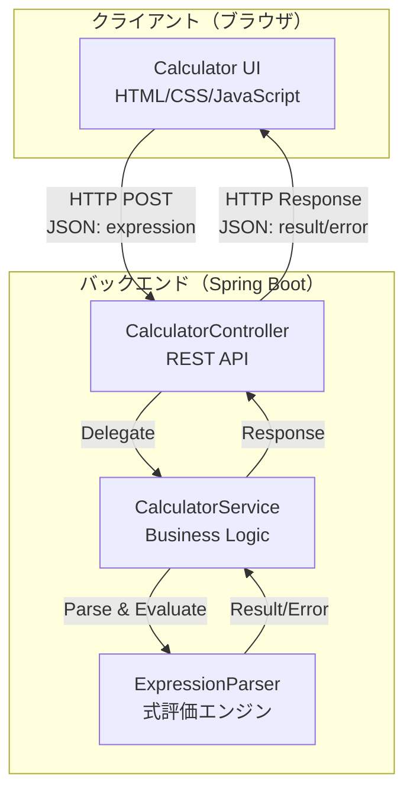
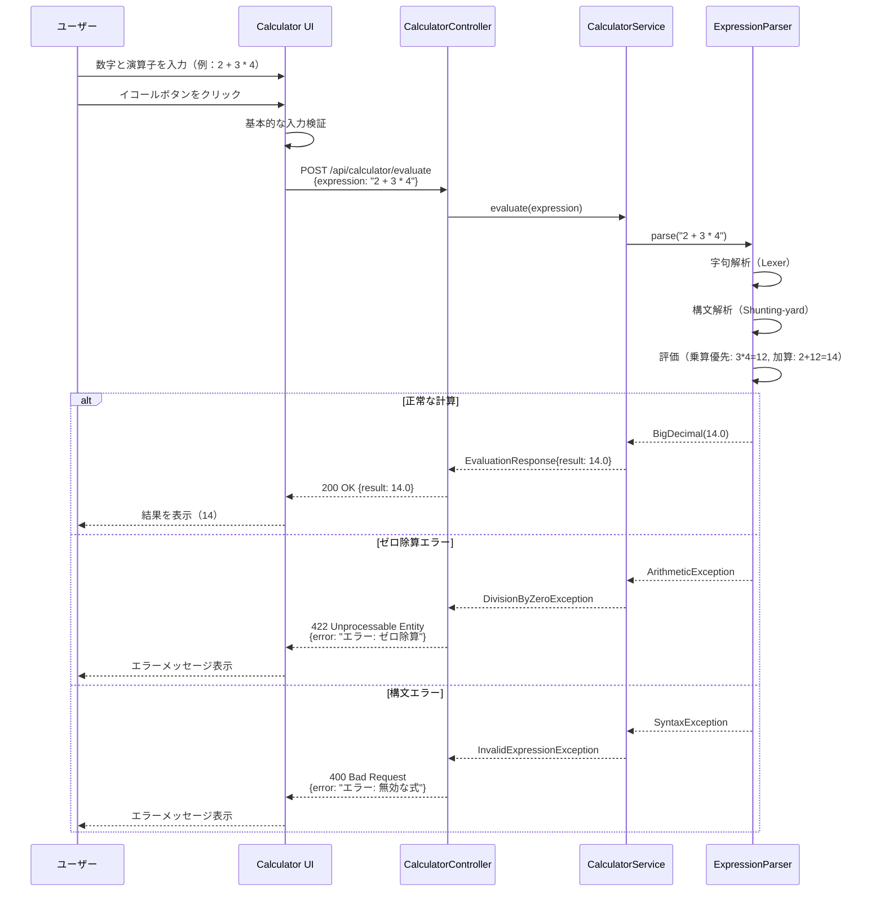

# Design Document

## Overview

**Purpose**: Java電卓webアプリは、ブラウザ上で動作する数式評価機能を提供します。ユーザーは直感的なUIを通じて複雑な四則演算式（例：`2 + 3 * 4`）を入力し、演算優先順位を考慮した正確な計算結果を即座に確認できます。

**Users**: 一般ユーザー（数値計算を必要とするすべての人）がWebブラウザからアクセスします。

**Impact**: 新規開発のWebアプリケーションであり、既存システムへの影響はありません。

### Goals

- Webブラウザから複雑な四則演算式（例：`2 + 3 * 4 = 14`）を評価可能
- 演算の優先順位（乗除が加減より優先）を正しく処理
- 整数および小数点数の計算をサポート
- 直感的なUIで数値と演算子を入力し、式を構築
- エラー（ゼロ除算、構文エラー、数値オーバーフロー）を適切に処理
- モダンブラウザ（Chrome、Firefox、Safari、Edge）で動作
- レスポンシブデザインによりモバイルデバイスでも利用可能

### Non-Goals

- 複雑な科学計算（三角関数、指数、対数など）
- 括弧のサポート（将来拡張の可能性あり）
- 計算履歴の永続化（将来拡張の可能性あり）
- ユーザー認証・アカウント管理
- マルチユーザー対応・リアルタイム共有

## Architecture

### Architecture Pattern & Boundary Map



**Architecture Integration**:
- **選択パターン**: 3層アーキテクチャ + SPA（Single Page Application）
  - **Presentation Layer**: HTML/CSS/JavaScript（クライアントサイド）
  - **Application Layer**: Spring Boot（サーバーサイド）
    - CalculatorController: REST APIエンドポイント
    - CalculatorService: ビジネスロジック調整
    - ExpressionParser: 式評価エンジン
  - **Data Layer**: 最小限（計算結果の一時的な保持のみ、永続化なし）
- **Domain/Feature Boundaries**:
  - フロントエンド（UI）: ユーザー入力の収集、式の構築、結果表示、基本的な入力検証
  - バックエンド（API）: 式の評価、演算優先順位処理、包括的なエラーハンドリング
  - ExpressionParser: 式のパース（字句解析・構文解析）、評価
- **New Components Rationale**:
  - CalculatorController: REST APIエンドポイントを提供し、クライアントとの通信を担当
  - CalculatorService: ビジネスロジックの調整とエラーハンドリングを担当
  - **ExpressionParser（新規）**: 複雑な式の評価と演算優先順位処理を担当（要件3.2対応）
  - CalculatorUI: ユーザーインターフェースとクライアントサイドロジックを担当
- **Steering Compliance**: ステアリングドキュメントが存在しないため、業界標準のベストプラクティス（research.mdに記録）に従う

### Technology Stack

| Layer | Choice / Version | Role in Feature | Notes |
|-------|------------------|-----------------|-------|
| Frontend | HTML5 / CSS3 / ES6+ JavaScript | UIレンダリング、式の構築、API通信 | Vanilla JS使用（フレームワーク不要） |
| Backend | Spring Boot 3.x (Java 17+) | REST APIエンドポイント、ビジネスロジック | 組み込みTomcat、簡単なデプロイ |
| Expression Parser | exp4j 0.4.8 (Maven) | 数式評価、演算優先順位処理 | Shunting-yardベース、軽量（25KB）、Apache License 2.0 |
| API | RESTful API (JSON) | フロントエンド・バックエンド間の通信 | ステートレス設計 |
| Infrastructure | JVM (Java 17 LTS) | バックエンド実行環境 | クロスプラットフォーム対応 |

**Technology Stack Rationale**:
- **Spring Boot**: 成熟したエコシステム、豊富なドキュメント、`@RestController`による簡潔なAPI実装
- **Vanilla JavaScript**: 依存関係ゼロ、軽量、シンプルなUIには十分（React/Vueは過剰）
- **exp4j**: シンプルな式評価に最適、Shunting-yardアルゴリズムベース、テスト済み、バグが少ない
- **RESTful API**: 業界標準、ステートレス設計によるスケーラビリティ
- **Java 17 LTS**: 長期サポート、最新のJava機能、Spring Boot 3.xとの互換性

詳細な技術選定の根拠と代替案の評価は `research.md` を参照。

## System Flows

### 式評価フロー



**Key Decisions**:
- クライアント側で基本的な入力検証を実施し、即座にフィードバック（UX向上）
- サーバー側で式のパース、評価、包括的な検証を実施（セキュリティとデータ整合性）
- ExpressionParserは式の評価に専念し、エラーは例外としてServiceに伝播
- HTTPステータスコードでエラーの種類を明確化（400: 構文エラー、422: ビジネスロジックエラー）

## Requirements Traceability

| Requirement | Summary | Components | Interfaces | Flows |
|-------------|---------|------------|------------|-------|
| 1.1-1.5 | 基本四則演算 | ExpressionParser, CalculatorService | ExpressionParser.parse() | 式評価フロー |
| 2.1-2.6 | UIコンポーネント | CalculatorUI | HTML/CSS/JS | - |
| 2.7 | 数字ボタンクリック処理 | CalculatorUI | JavaScript Event Handlers | - |
| 2.8 | 演算子ボタンクリック処理 | CalculatorUI | JavaScript Event Handlers | - |
| 3.1 | イコールボタンで式評価 | CalculatorUI, CalculatorController | POST /api/calculator/evaluate | 式評価フロー |
| 3.2 | 演算優先順位処理 | ExpressionParser | Shunting-yardアルゴリズム | 式評価フロー |
| 3.3 | 小数点精度（8桁） | ExpressionParser, CalculatorService | BigDecimal.setScale() | 式評価フロー |
| 3.4 | 連続計算 | CalculatorUI | クライアント側state管理 | - |
| 4.1 | ゼロ除算エラー | ExpressionParser, CalculatorService | Exception処理 | 式評価フロー（エラー分岐） |
| 4.2 | オーバーフローエラー | CalculatorService | Exception処理 | 式評価フロー（エラー分岐） |
| 4.3 | 無効入力エラー | ExpressionParser, CalculatorService | 構文解析エラー処理 | 式評価フロー（エラー分岐） |
| 4.4 | クリアボタンでリセット | CalculatorUI | JavaScript state reset | - |
| 5.1 | モダンブラウザ対応 | CalculatorUI | ES6+ JavaScript | - |
| 5.2 | レスポンシブデザイン | CalculatorUI | CSS Grid/Flexbox | - |
| 5.3 | 3秒以内に操作可能 | CalculatorUI | 軽量Vanilla JS | - |
| 5.4 | UI実装とAPI計算 | CalculatorUI（JavaScript UI）, Spring Boot（計算） | Fetch API | 式評価フロー |
| 5.5 | シンプルで分かりやすいデザイン | CalculatorUI | CSS | - |

## Components and Interfaces

### Component Summary

| Component | Domain/Layer | Intent | Req Coverage | Key Dependencies (P0/P1) | Contracts |
|-----------|--------------|--------|--------------|--------------------------|-----------|
| CalculatorController | Backend/API | REST APIエンドポイント提供 | 3.1 | CalculatorService (P0) | API |
| CalculatorService | Backend/Business | 式評価の調整とエラーハンドリング | 3.3, 4.1-4.3 | ExpressionParser (P0) | Service |
| ExpressionParser | Backend/Parser | 式の評価と演算優先順位処理 | 1.1-1.5, 3.2 | exp4j library (P0) | Service |
| CalculatorUI | Frontend/Presentation | ユーザーインターフェースと式構築 | 2.1-2.8, 3.4, 4.4, 5.1-5.5 | CalculatorController API (P0) | - |

### Backend / API Layer

#### CalculatorController

| Field | Detail |
|-------|--------|
| Intent | REST APIエンドポイントを提供し、クライアントからの式評価リクエストを受け付ける |
| Requirements | 3.1 |

**Responsibilities & Constraints**
- HTTPリクエストの受付とレスポンス返却
- リクエストパラメータの基本的な検証（式が空でないことなど）
- CalculatorServiceへの処理委譲
- 適切なHTTPステータスコードの設定

**Dependencies**
- Outbound: CalculatorService — 式評価ロジックの実行 (P0)

**Contracts**: API [x]

##### API Contract

| Method | Endpoint | Request | Response | Errors |
|--------|----------|---------|----------|--------|
| POST | /api/calculator/evaluate | EvaluationRequest | EvaluationResponse | 400, 422, 500 |

**Request Schema (JSON)**:
```json
{
  "expression": "string (数式, 例: '2 + 3 * 4')"
}
```

**Response Schema (Success - 200 OK)**:
```json
{
  "result": "number (double, 小数点以下8桁まで)"
}
```

**Response Schema (Error - 400/422)**:
```json
{
  "error": "string (エラーメッセージ)"
}
```

**Error Codes**:
- **400 Bad Request**: 構文エラー（無効な式、演算子の連続、括弧の不一致）
- **422 Unprocessable Entity**: ビジネスロジックエラー（ゼロ除算、数値オーバーフロー）
- **500 Internal Server Error**: サーバー内部エラー

**Implementation Notes**
- Integration: Spring Boot `@RestController`, `@PostMapping`アノテーション使用
- Validation: `@Valid`アノテーションによるリクエストバリデーション、式が空文字列でないことを確認
- Risks: CORS設定が必要（フロントエンドとバックエンドが異なるオリジンの場合）

#### CalculatorService

| Field | Detail |
|-------|--------|
| Intent | 式評価の調整、エラーハンドリング、結果の精度制御を担当 |
| Requirements | 3.3, 4.1, 4.2, 4.3 |

**Responsibilities & Constraints**
- ExpressionParserを呼び出して式を評価
- 評価結果の精度制御（小数点以下8桁）
- エラーのキャッチと適切な例外への変換（SyntaxException → InvalidExpressionException、ArithmeticException → DivisionByZeroException）
- ビジネスロジックレベルのバリデーション

**Dependencies**
- Outbound: ExpressionParser — 式のパース・評価 (P0)

**Contracts**: Service [x]

##### Service Interface

```java
public interface CalculatorService {
    /**
     * 数式を評価する
     *
     * @param expression 数式（例："2 + 3 * 4"）
     * @return 計算結果（小数点以下8桁まで）
     * @throws InvalidExpressionException 構文エラーの場合
     * @throws DivisionByZeroException ゼロ除算の場合
     * @throws OverflowException 数値オーバーフローの場合
     */
    BigDecimal evaluate(String expression)
        throws InvalidExpressionException, DivisionByZeroException, OverflowException;
}
```

**Preconditions**:
- `expression` は null でない、空文字列でない

**Postconditions**:
- 計算結果は小数点以下8桁に丸められる
- エラー時は適切な例外をスロー

**Invariants**:
- 評価ロジックはステートレス（副作用なし）
- 同一入力に対して常に同一結果を返す（決定論的）

**Implementation Notes**
- Integration: `@Service`アノテーションでSpring Beanとして登録、ExpressionParserを`@Autowired`でインジェクション
- Validation: ExpressionParserの例外をキャッチし、適切なビジネス例外に変換
- Risks: exp4jライブラリの例外仕様を正確に把握する必要がある

#### ExpressionParser

| Field | Detail |
|-------|--------|
| Intent | 数式の字句解析、構文解析、評価を実行し、演算優先順位を正しく処理 |
| Requirements | 1.1, 1.2, 1.3, 1.4, 1.5, 3.2 |

**Responsibilities & Constraints**
- 式の字句解析（トークン化）
- 構文解析（Shunting-yardアルゴリズムによる中置記法→RPN変換）
- 評価（RPNの計算実行）
- 演算優先順位の正しい処理（乗除 > 加減）
- 構文エラーの検出（無効な演算子配置、括弧の不一致など）

**Dependencies**
- External: exp4j library — 式評価エンジン (P0)

**Contracts**: Service [x]

##### Service Interface

```java
public interface ExpressionParser {
    /**
     * 数式をパースして評価する
     *
     * @param expression 数式文字列
     * @return 評価結果
     * @throws SyntaxException 構文エラーの場合
     * @throws ArithmeticException ゼロ除算などの算術エラーの場合
     */
    BigDecimal parse(String expression) throws SyntaxException, ArithmeticException;
}
```

**Preconditions**:
- `expression` は null でない、空文字列でない

**Postconditions**:
- 式が正しく評価され、BigDecimal型で結果を返す
- 構文エラー時は SyntaxException をスロー
- 算術エラー時は ArithmeticException をスロー

**Invariants**:
- パーサーはステートレス（式ごとに独立した評価）
- 演算優先順位は常に乗除 > 加減

**Implementation Notes**
- Integration: exp4jライブラリを使用（`ExpressionBuilder`クラス）
  ```java
  Expression e = new ExpressionBuilder(expression).build();
  double result = e.evaluate();
  return BigDecimal.valueOf(result);
  ```
- Validation: exp4jが提供する構文チェック機能を活用
- Risks:
  - exp4jの例外（`IllegalArgumentException`、`ArithmeticException`など）を適切にハンドリング
  - 非常に大きな数値や複雑な式のパフォーマンス（今回の要件では単純な四則演算のみのため影響小）
  - 括弧サポートはNon-Goalsだが、exp4jはデフォルトでサポート（将来拡張時に活用可能）

### Frontend / Presentation Layer

#### CalculatorUI

| Field | Detail |
|-------|--------|
| Intent | ユーザーインターフェースを提供し、式の構築とクライアントサイドのロジックを実装 |
| Requirements | 2.1, 2.2, 2.3, 2.4, 2.5, 2.6, 2.7, 2.8, 3.4, 4.4, 5.1, 5.2, 5.3, 5.4, 5.5 |

**Responsibilities & Constraints**
- 電卓UIの表示（数字ボタン、演算子ボタン、ディスプレイ、クリア・イコールボタン）
- ユーザー入力の収集と式の構築（例：`2 + 3 * 4`）
- バックエンドAPIへのHTTPリクエスト送信
- 計算結果またはエラーメッセージの表示
- レスポンシブデザインによるモバイル対応
- 連続計算のサポート（前回結果の再利用）

**Dependencies**
- Outbound: CalculatorController API — 式評価 (P0)

**Contracts**: State [x]

##### State Management

**State Model**:
```javascript
const state = {
  currentDisplay: "0",        // 現在のディスプレイ表示（構築中の式）
  expression: "",             // 構築された完全な式（例："2 + 3 * 4"）
  lastResult: null,           // 前回の計算結果（連続計算用）
  waitingForOperand: false    // 次のオペランド入力待ち
};
```

**Persistence & Consistency**:
- クライアント側のメモリにステートを保持（ページリロードで初期化）
- 将来的にlocalStorageで式履歴を保存可能（Non-Goalsのため現在は実装しない）

**Concurrency Strategy**:
- シングルスレッド（JavaScriptイベントループ）のため競合なし

**Implementation Notes**
- Integration:
  - HTML: セマンティックなマークアップ（`<button>`, `<div>`, `<input>`）
  - CSS: Grid/Flexboxによるレスポンシブレイアウト、メディアクエリでモバイル対応
  - JavaScript: ES6+文法（`const`, `let`, アロー関数、`async/await`）
  - Fetch API: バックエンドAPIとの通信
- Validation:
  - クライアント側で演算子の連続入力を防止（例：`+ +`は無効）
  - 数字と演算子以外の入力を拒否
- Risks:
  - ブラウザ互換性（ES6+がサポートされないレガシーブラウザ）→ 要件5.1でモダンブラウザのみサポート
  - CORS問題（異なるオリジンでの動作）→ バックエンドでCORS設定

**HTML Structure (概要)**:
```html
<div class="calculator">
  <div class="display" id="display">0</div>
  <div class="buttons">
    <button class="number" data-number="7">7</button>
    <!-- 0-9の数字ボタン -->
    <button class="operator" data-operator="+">+</button>
    <!-- +, -, *, / の演算子ボタン -->
    <button class="decimal">.</button>
    <button class="clear">C</button>
    <button class="equals">=</button>
  </div>
</div>
```

**JavaScript Event Handling (概要)**:
```javascript
// 数字ボタンクリック
document.querySelectorAll('.number').forEach(button => {
  button.addEventListener('click', (e) => {
    const number = e.target.dataset.number;
    appendToExpression(number);
  });
});

// 演算子ボタンクリック
document.querySelectorAll('.operator').forEach(button => {
  button.addEventListener('click', (e) => {
    const operator = e.target.dataset.operator;
    appendToExpression(' ' + operator + ' '); // スペースで区切る
  });
});

// イコールボタンクリック
document.querySelector('.equals').addEventListener('click', async () => {
  const result = await evaluateExpression(state.expression);
  displayResult(result);
});

// API通信
async function evaluateExpression(expression) {
  const response = await fetch('/api/calculator/evaluate', {
    method: 'POST',
    headers: { 'Content-Type': 'application/json' },
    body: JSON.stringify({ expression })
  });
  return await response.json();
}
```

## Data Models

### Domain Model

**Entities**:
- **EvaluationRequest**: 式評価リクエストを表す値オブジェクト
  - `expression: String` — 数式（例："2 + 3 * 4"）

- **EvaluationResponse**: 式評価結果またはエラーを表す値オブジェクト
  - `result: BigDecimal` — 計算結果（成功時）
  - `error: String` — エラーメッセージ（エラー時）

**Business Rules & Invariants**:
- 式は空文字列でない
- 演算子は `+`, `-`, `*`, `/` のみ許可
- 除算時、ゼロ除算が発生した場合はエラー
- 結果は小数点以下8桁に丸める

### Logical Data Model

**Structure Definition**:
```
EvaluationRequest
  └── expression: String (NOT NULL, NOT EMPTY)

EvaluationResponse (Success)
  └── result: BigDecimal (SCALE = 8)

EvaluationResponse (Error)
  └── error: String (NOT NULL)
```

**Consistency & Integrity**:
- リクエストとレスポンスは1対1の関係
- ステートレス設計のため、トランザクション境界は単一のHTTPリクエスト・レスポンスサイクル
- データの永続化なし

### Data Contracts & Integration

**API Data Transfer**:
- **Serialization Format**: JSON
- **Validation Rules**:
  - `expression` は文字列で、空でない
- **Error Response Format**:
  ```json
  {
    "error": "エラーメッセージ"
  }
  ```

## Error Handling

### Error Strategy

エラーは多層で処理し、ユーザーに明確なフィードバックを提供します：
1. **クライアント側**: 基本的な入力検証（演算子の連続入力防止）
2. **ExpressionParser**: 構文エラーの検出と例外スロー
3. **CalculatorService**: 例外のキャッチと適切なビジネス例外への変換
4. **CalculatorController**: HTTPステータスコードの設定とエラーレスポンス返却

### Error Categories and Responses

#### User Errors (4xx)

**400 Bad Request**:
- **原因**: 構文エラー（無効な式、演算子の連続、括弧の不一致）
- **対応**: 構文エラーの詳細を説明
- **例**: `{"error": "エラー: 無効な式 '2 + + 3'"}"`

**422 Unprocessable Entity**:
- **原因**: ビジネスロジックエラー（ゼロ除算、数値オーバーフロー）
- **対応**: エラーの原因と対処法を説明
- **例**: `{"error": "エラー: ゼロ除算"}`

#### System Errors (5xx)

**500 Internal Server Error**:
- **原因**: サーバー内部エラー（予期しない例外）
- **対応**: 一般的なエラーメッセージを返し、詳細はサーバーログに記録
- **例**: `{"error": "サーバーエラーが発生しました。しばらくしてから再試行してください"}`

#### Business Logic Errors (422)

**ゼロ除算**:
- **条件**: 式の評価中にゼロ除算が発生
- **対応**: `ArithmeticException` をキャッチし、`DivisionByZeroException` に変換、422レスポンス
- **メッセージ**: "エラー: ゼロ除算"

**数値オーバーフロー**:
- **条件**: BigDecimalの範囲を超える計算結果
- **対応**: `OverflowException` をスロー、422レスポンス
- **メッセージ**: "エラー: 数値が範囲外"

**構文エラー (400)**:
- **条件**: 無効な式（演算子の連続、括弧の不一致、無効な文字）
- **対応**: ExpressionParserが `SyntaxException` をスロー、CalculatorServiceが `InvalidExpressionException` に変換、400レスポンス
- **メッセージ**: "エラー: 無効な式 '[expression]'"

### Monitoring

- **Error Tracking**: Spring Bootのロギングフレームワーク（Logback）でエラーログを記録
- **Logging**: すべての例外をERRORレベルで記録、スタックトレースを含む
- **Health Monitoring**: Spring Boot Actuatorの `/actuator/health` エンドポイントでヘルスチェック（将来的に導入）

## Testing Strategy

### Unit Tests

**ExpressionParser**:
1. 基本的な四則演算の正確性（加算、減算、乗算、除算）
2. 演算優先順位の処理（例：`2 + 3 * 4 = 14`）
3. ゼロ除算の例外処理
4. 構文エラーの検出（例：`2 + + 3`、`* 5`）
5. 小数点数の計算（例：`1.5 * 2 = 3.0`）

**CalculatorService**:
1. 結果の精度制御（小数点以下8桁）
2. 例外の変換（SyntaxException → InvalidExpressionException）
3. エラーハンドリングの網羅性

**テストフレームワーク**: JUnit 5, AssertJ, Mockito

### Integration Tests

**CalculatorController API**:
1. 正常な式評価リクエスト・レスポンスのフロー
2. エラーレスポンスのHTTPステータスコード検証
3. JSON シリアライズ・デシリアライズの確認
4. CORS設定の検証（異なるオリジンからのリクエスト）
5. 並行リクエストの処理（ステートレス性の確認）

**テストフレームワーク**: Spring Boot Test, MockMvc, RestAssured

### E2E/UI Tests

**CalculatorUI**:
1. ボタンクリックによる式の構築（例：`2 + 3 * 4`）
2. イコールボタンによる式評価と結果表示
3. エラーメッセージの表示確認（構文エラー、ゼロ除算）
4. クリアボタンによる状態リセット
5. レスポンシブデザインのモバイル表示確認

**テストフレームワーク**: Selenium WebDriver, Jest（JavaScript unit tests）

### Performance/Load Tests

1. 並行リクエスト処理能力（100リクエスト/秒）
2. レスポンスタイム（平均100ms以下）
3. ページロード時間（3秒以内 - 要件5.3）
4. メモリ使用量の安定性

**テストツール**: JMeter, Gatling

## Security Considerations

**Input Validation**:
- クライアント側とサーバー側の二重検証
- 式の文字列長制限（例：最大256文字）
- 許可する文字のホワイトリスト（数字、演算子、小数点、スペース）

**XSS (Cross-Site Scripting) 対策**:
- ユーザー入力は数式文字列のみのため、XSSリスクは最小限
- エラーメッセージにユーザー入力を含める場合、エスケープ処理を実装

**CSRF (Cross-Site Request Forgery) 対策**:
- Spring Securityによる保護（現在は静的コンテンツのため最小限）
- 将来的にセッションベースの機能が追加される場合、CSRFトークンを実装

**CORS (Cross-Origin Resource Sharing)**:
- バックエンドで `@CrossOrigin` アノテーションまたはグローバルCORS設定を有効化
- 許可するオリジンを明示的に指定

**Dependency Security**:
- exp4jライブラリの最新バージョンを使用（既知の脆弱性がないことを確認）
- 定期的な依存関係のセキュリティスキャン

**Error Message Disclosure**:
- エラーメッセージは一般的な内容にとどめ、システム内部情報を露出しない
- 詳細なスタックトレースはサーバーログにのみ記録

## Performance & Scalability

### Target Metrics

- **レスポンスタイム**: 平均100ms以下、95パーセンタイル200ms以下
- **ページロード時間**: 3秒以内（要件5.3）
- **並行リクエスト**: 100リクエスト/秒を処理可能
- **可用性**: 99.9%（将来的な目標）

### Scaling Approaches

**Horizontal Scaling**:
- Spring Bootアプリケーションはステートレスのため、複数インスタンスを容易にデプロイ可能
- ロードバランサー（Nginx、AWS ELB）による負荷分散

**Vertical Scaling**:
- 式評価処理は軽量のため、スケールアップの必要性は低い
- 必要に応じてJVMヒープサイズを調整

### Caching Strategies

**現在の実装**: キャッシング不要（式評価は毎回異なる入力）

**将来的な拡張**: 計算履歴機能が追加される場合、クライアント側のlocalStorageまたはサーバー側のRedisキャッシュを検討

### Optimization Techniques

- **静的コンテンツの配信**: HTML/CSS/JSファイルをCDN経由で配信（将来的）
- **Gzip圧縮**: HTTPレスポンスの圧縮によるネットワーク転送量削減
- **バンドルの最小化**: JavaScriptファイルのMinify（Vanilla JSのため影響小）
- **式評価の最適化**: exp4jライブラリの最適化機能を活用
